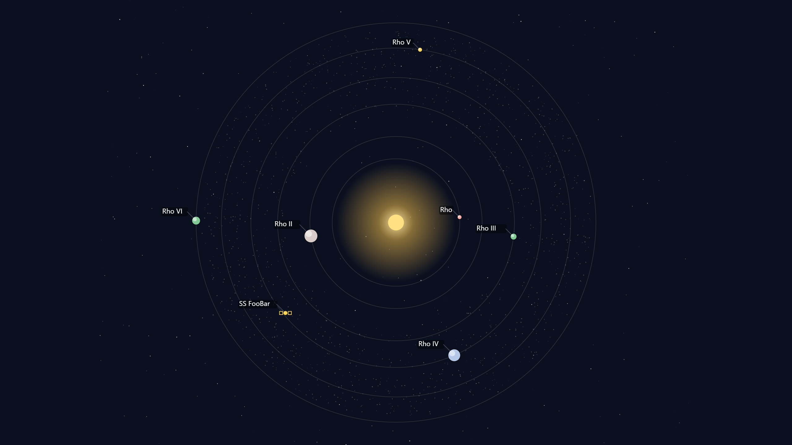
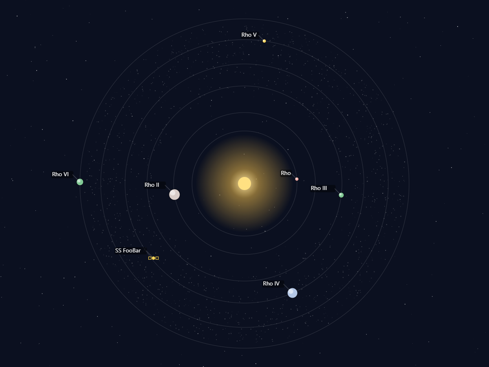

Star System Map Generator
=========================

An interactive TTRPG-friendly star system generator built with Next.js, React, and TypeScript. Render systems in Canvas or SVG, customize planets, belts, and stations, and export high-resolution images.

Built collaboratively with GitHub Copilot.

Features
--------
- Deterministic system generation via seed
- Up to 3 stars per system with different types and visuals (yellow, red dwarf, blue giant, neutron, black hole)
- Per-planet customization: name, size, color, moons, rings, label toggle
- Asteroid belts: free or anchored between orbits, width and density controls
- Space stations: multiple icons, custom image, color/size, position/place on canvas, label toggle
- Labels: per-object visibility with global style (position, size, color, optional background)
- Dual renderers: Canvas and SVG
- Export:
	- PNG at current size
	- Upscaled PNG (720p, 1080p, 2K, 1440p, 4K)
	- Raw SVG (in SVG mode)
	- JSON (round-trip system state, including embedded custom station icons)

Quick start
-----------

Prerequisites: Node.js 20+ recommended.

Development server:

```bash
npm install
npm run dev
```

Then open http://localhost:3000 in your browser.

Production build:

```bash
npm run build
npm start
```

Usage tips
----------
- Use the left sidebar to configure labels, stars, planets, stations, and belts.
- Switch between Canvas and SVG using the header toggle.
- Export PNG/SVG/JSON from the header actions. Upscaled PNG uses the selected preset.
- Import JSON to restore a saved configuration.

Tech stack
----------
- Next.js 16 (App Router)
- React 19
- TypeScript
- Tailwind CSS v4

Acknowledgements
----------------
This project and its features were implemented with assistance from GitHub Copilot, including renderer implementations, export flows, and UI wiring.

Screenshots
-----------

| Example 1 | Example 2 | Example 3 |
|-----------|-----------|-----------|
|  |  |  |
